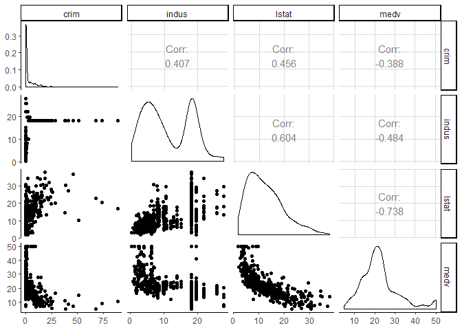

Intro\_Data\_Visualization
================

### 1\. Load packages and check loading

``` r
if(!require("pacman")) install.packages("pacman")
pacman::p_load(forecast, tidyverse, gplots, GGally, mosaic,
               scales, mosaic, mapproj, mlbench, data.table)
search()
theme_set(theme_classic())
```

### 2\. Read in Boston Housing Data from *mlbench* package

``` r
## Read Boston Housing data
data("BostonHousing")
  
#default: data frame
housing.df <- BostonHousing
housing.dt <- setDT(housing.df)

# preferred: data.table

housing.dt[, cat.medv := ifelse(medv>30,1,0)] #create a categorical medv variable
```

### 3\. Generate Data Visualizations

``` r
# use alpha for transperancy [0,1]
ggplot(housing.df) +
  geom_point(aes(x = lstat, y = medv), color = "tomato2", alpha = 0.4) +
  ggtitle("Median Housing Price")
```

<!-- -->

``` r
# Barchart - Is there any difference in mean(medv) by chas?
data.for.plot <- housing.dt[, .(meanMEDV = mean(medv)), by=chas]
ggplot(data.for.plot) + 
  geom_bar(aes(x = chas, y = meanMEDV), stat = "identity", width =.4, fill="seagreen") +
  coord_flip() +
  ylab("mean home price") +
  ggtitle("Average Median Housing Price")
```

<!-- -->

``` r
# Barchart - Are there propotionately more high-value homes when chas=1?
data.for.plot2 <- housing.dt[, .(percent_medv = sum(cat.medv)*100/ .N), keyby=chas]
ggplot(data.for.plot2) +
  coord_flip() +
  geom_bar(aes(x=chas, y = percent_medv), stat = "identity", width = 0.4, 
  fill = "wheat", color = "brown2") +
  ylab("Percent homes > $30K") +
  ggtitle("Percentage of High-Value Homes by Chas")
```

<!-- -->

``` r
# histogram of medv variable - does it look like a normal distribution?
ggplot(housing.dt) +
  geom_histogram(aes(x = medv), binwidth = 5, fill = "goldenrod2") +
  ggtitle("Histogram of MEDV Variable")
```

<!-- -->

``` r
ggplot(housing.dt) +
  geom_boxplot(aes(x = chas, y = medv), 
               fill = "gold1", outlier.color = "firebrick2") + 
  xlab("Charles River Dummy") + ggtitle("Where are the Outliers?")
```

<!-- -->

``` r
# simple heatmap of correlations (without values)
heatmap(cor(housing.dt[,!c("chas")]), Rowv = NA, Colv = NA)
```

<!-- -->

``` r
# heatmap using ggplot
# using reshape package to to generate input for the plot 
library(reshape)
cor.mat <- round(cor(housing.dt[,!c("chas", "cat.medv")]),2) # rounded correlation matrix 
melted.cor.mat <- melt(cor.mat) 
ggplot(melted.cor.mat, aes(x = X1, y = X2, fill = value)) + 
  scale_fill_gradient(low="wheat", high="orangered") +
  geom_tile() + 
  geom_text(aes(x = X1, y = X2, label = value)) +
  ggtitle("Which Variables Are Highly Correlated?")
```

<!-- -->

``` r
# example of multidimensional plot - use third variable for color coding
ggplot(housing.dt, aes(y = nox, x = lstat, color= as.factor(cat.medv))) +
  geom_point(alpha = 0.6)
```

<!-- -->

``` r
# Computing mean MEDV by RAD & CHAS
data.for.plot3 <- housing.dt[, .(meanMedv = mean(medv)), keyby=.(rad, chas)]
ggplot(data.for.plot3) +
  geom_bar(aes(x = as.factor(rad), y = `meanMedv`), stat = "identity", 
           fill = "wheat1", color = "red") +
  xlab("accessability to radial highways") + facet_grid(chas ~ .) 
```

<!-- -->

``` r
plot(housing.dt[, c("crim", "indus", "lstat", "medv")])
```

<!-- -->

``` r
# Alternative -- reports correlation coefficient
# using GGally package
ggpairs(housing.dt[, c("crim", "indus", "lstat", "medv")])
```

<!-- -->
