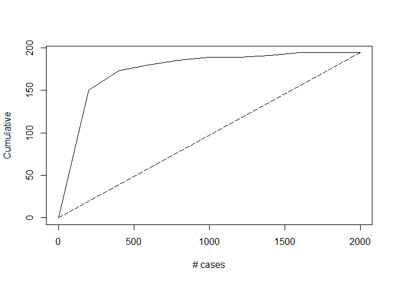

Intro\_LogisticRegression
================

``` r
pacman::p_load(caret, data.table, gains, leaps, MASS, tidyverse)
theme_set(theme_classic())
```

## Logistic Regression using Universal Bank data

``` r
bank.dt <- fread("UniversalBank.csv")
bank.dt <- bank.dt[ , -c(1,5)]  # Drop ID and zip code columns

names(bank.dt) <- gsub('\\s', '_', names(bank.dt))

# Convert "Education" to categorical variable
bank.dt$Education <- factor(bank.dt$Education, levels = c(1, 2, 3), 
                            labels = c("Undergrad", "Graduate", "Adv/Prof"))
bank.df <- setDF(bank.dt)
head(bank.df)
```

    ##   Age Experience Income Family CCAvg Education Mortgage Personal_Loan
    ## 1  25          1     49      4   1.6 Undergrad        0             0
    ## 2  45         19     34      3   1.5 Undergrad        0             0
    ## 3  39         15     11      1   1.0 Undergrad        0             0
    ## 4  35          9    100      1   2.7  Graduate        0             0
    ## 5  35          8     45      4   1.0  Graduate        0             0
    ## 6  37         13     29      4   0.4  Graduate      155             0
    ##   Securities_Account CD_Account Online CreditCard
    ## 1                  1          0      0          0
    ## 2                  1          0      0          0
    ## 3                  0          0      0          0
    ## 4                  0          0      0          0
    ## 5                  0          0      0          1
    ## 6                  0          0      1          0

``` r
set.seed(13)
train.index <- createDataPartition(bank.df$Personal_Loan, p = 0.6, list = FALSE)
train.df <- bank.df[train.index, ]
valid.df <- bank.df[-train.index, ]
```

**Logistic
Regression**

``` r
logit.reg <- glm(Personal_Loan ~ ., data = train.df, family = "binomial") 

options(scipen=999)
summary(logit.reg)
```

    ## 
    ## Call:
    ## glm(formula = Personal_Loan ~ ., family = "binomial", data = train.df)
    ## 
    ## Deviance Residuals: 
    ##     Min       1Q   Median       3Q      Max  
    ## -2.2045  -0.1775  -0.0620  -0.0172   4.2626  
    ## 
    ## Coefficients:
    ##                       Estimate  Std. Error z value             Pr(>|z|)
    ## (Intercept)        -12.5159238   2.5703338  -4.869  0.00000111950785903
    ## Age                 -0.0649415   0.0958633  -0.677             0.498128
    ## Experience           0.0688205   0.0948753   0.725             0.468220
    ## Income               0.0624108   0.0041009  15.219 < 0.0000000000000002
    ## Family               0.5957165   0.1026411   5.804  0.00000000647977887
    ## CCAvg                0.2322143   0.0620682   3.741             0.000183
    ## EducationGraduate    4.6375429   0.3902387  11.884 < 0.0000000000000002
    ## EducationAdv/Prof    4.7296016   0.3869380  12.223 < 0.0000000000000002
    ## Mortgage             0.0018824   0.0008384   2.245             0.024752
    ## Securities_Account  -0.9446436   0.3943880  -2.395             0.016611
    ## CD_Account           3.7151142   0.4644609   7.999  0.00000000000000126
    ## Online              -0.6877936   0.2197240  -3.130             0.001747
    ## CreditCard          -0.8705782   0.2851185  -3.053             0.002263
    ##                       
    ## (Intercept)        ***
    ## Age                   
    ## Experience            
    ## Income             ***
    ## Family             ***
    ## CCAvg              ***
    ## EducationGraduate  ***
    ## EducationAdv/Prof  ***
    ## Mortgage           *  
    ## Securities_Account *  
    ## CD_Account         ***
    ## Online             ** 
    ## CreditCard         ** 
    ## ---
    ## Signif. codes:  0 '***' 0.001 '**' 0.01 '*' 0.05 '.' 0.1 ' ' 1
    ## 
    ## (Dispersion parameter for binomial family taken to be 1)
    ## 
    ##     Null deviance: 1888.24  on 2999  degrees of freedom
    ## Residual deviance:  659.37  on 2987  degrees of freedom
    ## AIC: 685.37
    ## 
    ## Number of Fisher Scoring iterations: 8

``` r
# Generate odds-ratios
exp(coef(logit.reg))
```

    ##        (Intercept)                Age         Experience 
    ##     0.000003667781     0.937122308015     1.071243929687 
    ##             Income             Family              CCAvg 
    ##     1.064399531604     1.814330445959     1.261390003957 
    ##  EducationGraduate  EducationAdv/Prof           Mortgage 
    ##   103.290245128931   113.250434961855     1.001884158245 
    ## Securities_Account         CD_Account             Online 
    ##     0.388818107387    41.063277844014     0.502683993185 
    ##         CreditCard 
    ##     0.418709391866

## Model Selection

``` r
logitnew <- stepAIC(logit.reg, trace = 0)  # trace = 0 suppress intermediate steps
```

## Performance Evaluation

``` r
logit.reg.pred <- predict(logit.reg, valid.df[, -8], type = "response")

t(t(head(logit.reg.pred, 10)))
```

    ##             [,1]
    ## 4  0.11222917924
    ## 7  0.01603865523
    ## 9  0.04864222900
    ## 12 0.00412516046
    ## 20 0.00008996875
    ## 26 0.00002054548
    ## 29 0.00109654546
    ## 32 0.00075153116
    ## 43 0.81600545051
    ## 49 0.03869372932

``` r
# generate confusion matrix
table(valid.df$Personal_Loan , logit.reg.pred > 0.5)
```

    ##    
    ##     FALSE TRUE
    ##   0  1783   23
    ##   1    60  134

## Lift Chart

``` r
gain <- gains(valid.df$Personal_Loan, logit.reg.pred, groups = 10)

  ### Plot Lift Chart
plot(c(0,gain$cume.pct.of.total*sum(valid.df$Personal_Loan))~c(0,gain$cume.obs), 
     xlab = "# cases", ylab = "Cumulative", main = "", type = "l")
lines(c(0,sum(valid.df$Personal_Loan))~c(0, dim(valid.df)[1]), lty = 5)
```

<!-- -->

``` r
  ### Plot decile-wise chart
heights <- gain$mean.resp/mean(valid.df$Personal_Loan)
midpoints <- barplot(heights, names.arg = gain$depth,  ylim = c(0,9), col = "gold3",  
                     xlab = "Percentile", ylab = "Mean Response", 
                     main = "Decile-wise lift chart")
```

<!-- -->
