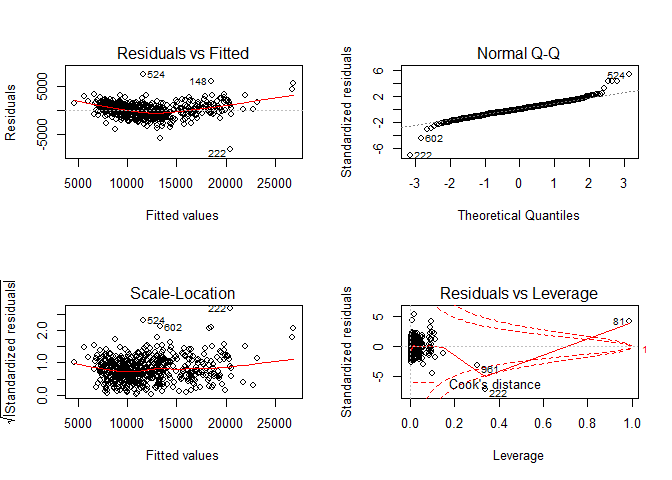
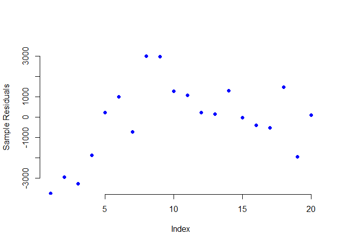

Intro\_Regression
================

``` r
pacman::p_load(data.table, forecast, leaps, tidyverse)
```

``` r
car.df <- read.csv("ToyotaCorolla.csv")

# Use first 1000 rows of data
car.df <- car.df[1:1000,]


# Select variables for regression
car.df <- car.df[, c(3, 4, 7, 8, 9, 10, 12, 13, 14, 17, 18)]
```

``` r
set.seed(123)  
train.index <- sample(c(1:1000), 600)  
train.df <- car.df[train.index, ]
valid.df <- car.df[-train.index, ]
```

``` r
car.lm <- lm(Price ~ ., data = train.df)

options(scipen = 999)
summary(car.lm)
```

    ## 
    ## Call:
    ## lm(formula = Price ~ ., data = train.df)
    ## 
    ## Residuals:
    ##     Min      1Q  Median      3Q     Max 
    ## -8003.2  -770.1   -19.3   803.5  7351.1 
    ## 
    ## Coefficients:
    ##                    Estimate  Std. Error t value             Pr(>|t|)    
    ## (Intercept)     -940.754615 1631.478126  -0.577               0.5644    
    ## Age_08_04       -136.893797    4.814012 -28.437 < 0.0000000000000002 ***
    ## KM                -0.021211    0.002214  -9.582 < 0.0000000000000002 ***
    ## Fuel_TypeDiesel 1133.421346  490.750837   2.310               0.0213 *  
    ## Fuel_TypePetrol 2278.948500  466.626514   4.884  0.00000134245478001 ***
    ## HP                35.630941    5.294743   6.729  0.00000000004049036 ***
    ## Met_Color        -12.414469  122.844060  -0.101               0.9195    
    ## Automatic        124.187190  269.147040   0.461               0.6447    
    ## CC                 0.030445    0.097338   0.313               0.7546    
    ## Doors             -9.349893   63.064917  -0.148               0.8822    
    ## Quarterly_Tax     16.314767    2.390268   6.825  0.00000000002186691 ***
    ## Weight            12.472610    1.538229   8.108  0.00000000000000299 ***
    ## ---
    ## Signif. codes:  0 '***' 0.001 '**' 0.01 '*' 0.05 '.' 0.1 ' ' 1
    ## 
    ## Residual standard error: 1385 on 588 degrees of freedom
    ## Multiple R-squared:  0.8669, Adjusted R-squared:  0.8644 
    ## F-statistic: 348.2 on 11 and 588 DF,  p-value: < 0.00000000000000022

``` r
class(car.lm)
```

    ## [1] "lm"

``` r
methods(class=class(car.lm))
```

    ##  [1] add1           alias          anova          case.names    
    ##  [5] coerce         confint        cooks.distance deviance      
    ##  [9] dfbeta         dfbetas        drop1          dummy.coef    
    ## [13] effects        extractAIC     family         forecast      
    ## [17] formula        fortify        getResponse    hatvalues     
    ## [21] influence      initialize     kappa          labels        
    ## [25] logLik         model.frame    model.matrix   nobs          
    ## [29] plot           predict        print          proj          
    ## [33] qqnorm         qr             residuals      rstandard     
    ## [37] rstudent       show           simulate       slotsFromS3   
    ## [41] summary        variable.names vcov          
    ## see '?methods' for accessing help and source code

``` r
confint(car.lm)
```

    ##                          2.5 %        97.5 %
    ## (Intercept)     -4144.98848101 2263.47925122
    ## Age_08_04        -146.34854822 -127.43904559
    ## KM                 -0.02555809   -0.01686305
    ## Fuel_TypeDiesel   169.58344593 2097.25924706
    ## Fuel_TypePetrol  1362.49093010 3195.40606959
    ## HP                 25.23203018   46.02985238
    ## Met_Color        -253.68101773  228.85207888
    ## Automatic        -404.41938243  652.79376156
    ## CC                 -0.16072741    0.22161752
    ## Doors            -133.20980728  114.51002211
    ## Quarterly_Tax      11.62026377   21.00926927
    ## Weight              9.45151800   15.49370253

``` r
par(mfrow = c(2,2))
plot(car.lm)
```

    ## Warning in sqrt(crit * p * (1 - hh)/hh): NaNs produced
    
    ## Warning in sqrt(crit * p * (1 - hh)/hh): NaNs produced

<!-- -->

``` r
par(mfrow = c(1,1))
```

``` r
car.lm.pred <- predict(car.lm, valid.df)

some.residuals <- valid.df$Price[1:20] - car.lm.pred[1:20]

plot(some.residuals, type = "p", pch = 16,
     col = "blue1",
     ylab = "Sample Residuals", 
     ylim = c(-3500, 3500), bty = "n"
     )
```

<!-- -->

``` r
data.frame("Predicted" = car.lm.pred[1:20], "Actual" = valid.df$Price[1:20],
           "Residual" = some.residuals)
```

    ##    Predicted Actual    Residual
    ## 1   17231.41  13500 -3731.41206
    ## 2   16680.98  13750 -2930.97650
    ## 3   17206.40  13950 -3256.40403
    ## 4   16811.64  14950 -1861.63762
    ## 7   16671.47  16900   228.52902
    ## 9   20503.63  21500   996.37494
    ## 12  20680.95  19950  -730.94926
    ## 15  19500.65  22500  2999.34816
    ## 17  19777.22  22750  2972.78199
    ## 18  16688.77  17950  1261.22505
    ## 21  14892.91  15950  1057.08637
    ## 22  16725.71  16950   224.29260
    ## 25  16104.50  16250   145.50459
    ## 27  16193.07  17495  1301.92772
    ## 28  15773.57  15750   -23.56806
    ## 32  16144.93  15750  -394.92610
    ## 35  16021.88  15500  -521.88357
    ## 42  15272.34  16750  1477.65945
    ## 43  15907.86  13950 -1957.86182
    ## 44  16846.51  16950   103.49120

``` r
accuracy(car.lm.pred, valid.df$Price)
```

    ##                ME     RMSE      MAE       MPE     MAPE
    ## Test set 40.07658 1363.788 1062.376 -0.762567 9.348844

**SUBSET SELECTION **  
**Exhaustive Search
**

``` r
search <- regsubsets(Price ~ ., data = train.df, nbest = 1, nvmax = dim(train.df)[2],
                     method = "exhaustive")
sum <- summary(search)

# show models
sum$which
```

    ##    (Intercept) Age_08_04    KM Fuel_TypeDiesel Fuel_TypePetrol    HP
    ## 1         TRUE      TRUE FALSE           FALSE           FALSE FALSE
    ## 2         TRUE      TRUE FALSE           FALSE           FALSE FALSE
    ## 3         TRUE      TRUE  TRUE           FALSE           FALSE FALSE
    ## 4         TRUE      TRUE  TRUE           FALSE           FALSE  TRUE
    ## 5         TRUE      TRUE  TRUE           FALSE           FALSE  TRUE
    ## 6         TRUE      TRUE  TRUE           FALSE            TRUE  TRUE
    ## 7         TRUE      TRUE  TRUE            TRUE            TRUE  TRUE
    ## 8         TRUE      TRUE  TRUE            TRUE            TRUE  TRUE
    ## 9         TRUE      TRUE  TRUE            TRUE            TRUE  TRUE
    ## 10        TRUE      TRUE  TRUE            TRUE            TRUE  TRUE
    ## 11        TRUE      TRUE  TRUE            TRUE            TRUE  TRUE
    ##    Met_Color Automatic    CC Doors Quarterly_Tax Weight
    ## 1      FALSE     FALSE FALSE FALSE         FALSE  FALSE
    ## 2      FALSE     FALSE FALSE FALSE         FALSE   TRUE
    ## 3      FALSE     FALSE FALSE FALSE         FALSE   TRUE
    ## 4      FALSE     FALSE FALSE FALSE         FALSE   TRUE
    ## 5      FALSE     FALSE FALSE FALSE          TRUE   TRUE
    ## 6      FALSE     FALSE FALSE FALSE          TRUE   TRUE
    ## 7      FALSE     FALSE FALSE FALSE          TRUE   TRUE
    ## 8      FALSE      TRUE FALSE FALSE          TRUE   TRUE
    ## 9      FALSE      TRUE  TRUE FALSE          TRUE   TRUE
    ## 10     FALSE      TRUE  TRUE  TRUE          TRUE   TRUE
    ## 11      TRUE      TRUE  TRUE  TRUE          TRUE   TRUE

``` r
# show metrics
sum$rsq
```

    ##  [1] 0.7628853 0.7967287 0.8384164 0.8543579 0.8610604 0.8655617 0.8668149
    ##  [8] 0.8668792 0.8669001 0.8669055 0.8669078

``` r
sum$adjr2
```

    ##  [1] 0.7624888 0.7960477 0.8376030 0.8533788 0.8598909 0.8642015 0.8652401
    ##  [8] 0.8650772 0.8648698 0.8646459 0.8644180

``` r
sum$cp
```

    ##  [1] 451.570589 304.050815 121.875022  53.445353  25.833795   7.947238
    ##  [7]   4.410542   6.126628   8.034038  10.010213  12.000000

**Backward Selection **

``` r
car.lm.bselect <- step(car.lm, direction = "backward")
```

    ## Start:  AIC=8692.29
    ## Price ~ Age_08_04 + KM + Fuel_Type + HP + Met_Color + Automatic + 
    ##     CC + Doors + Quarterly_Tax + Weight
    ## 
    ##                 Df  Sum of Sq        RSS    AIC
    ## - Met_Color      1      19599 1128426357 8690.3
    ## - Doors          1      42182 1128448940 8690.3
    ## - CC             1     187740 1128594498 8690.4
    ## - Automatic      1     408566 1128815324 8690.5
    ## <none>                        1128406758 8692.3
    ## - Fuel_Type      2   48477882 1176884640 8713.5
    ## - HP             1   86906671 1215313429 8734.8
    ## - Quarterly_Tax  1   89403966 1217810724 8736.0
    ## - Weight         1  126171417 1254578175 8753.9
    ## - KM             1  176195766 1304602524 8777.3
    ## - Age_08_04      1 1551820812 2680227570 9209.3
    ## 
    ## Step:  AIC=8690.3
    ## Price ~ Age_08_04 + KM + Fuel_Type + HP + Automatic + CC + Doors + 
    ##     Quarterly_Tax + Weight
    ## 
    ##                 Df  Sum of Sq        RSS    AIC
    ## - Doors          1      45722 1128472079 8688.3
    ## - CC             1     184080 1128610437 8688.4
    ## - Automatic      1     414481 1128840838 8688.5
    ## <none>                        1128426357 8690.3
    ## - Fuel_Type      2   48763064 1177189421 8711.7
    ## - HP             1   86888740 1215315097 8732.8
    ## - Quarterly_Tax  1   89571958 1217998315 8734.1
    ## - Weight         1  126311753 1254738110 8752.0
    ## - KM             1  176181418 1304607775 8775.3
    ## - Age_08_04      1 1563371710 2691798067 9209.9
    ## 
    ## Step:  AIC=8688.32
    ## Price ~ Age_08_04 + KM + Fuel_Type + HP + Automatic + CC + Quarterly_Tax + 
    ##     Weight
    ## 
    ##                 Df  Sum of Sq        RSS    AIC
    ## - CC             1     177684 1128649764 8686.4
    ## - Automatic      1     423290 1128895370 8686.5
    ## <none>                        1128472079 8688.3
    ## - Fuel_Type      2   48893270 1177365349 8709.8
    ## - HP             1   87719995 1216192075 8731.2
    ## - Quarterly_Tax  1   89838236 1218310315 8732.3
    ## - Weight         1  133079019 1261551098 8753.2
    ## - KM             1  177145287 1305617367 8773.8
    ## - Age_08_04      1 1565986397 2694458476 9208.5
    ## 
    ## Step:  AIC=8686.41
    ## Price ~ Age_08_04 + KM + Fuel_Type + HP + Automatic + Quarterly_Tax + 
    ##     Weight
    ## 
    ##                 Df  Sum of Sq        RSS    AIC
    ## - Automatic      1     544848 1129194612 8684.7
    ## <none>                        1128649764 8686.4
    ## - Fuel_Type      2   48798605 1177448369 8707.8
    ## - HP             1   89952473 1218602237 8730.4
    ## - Quarterly_Tax  1   89984992 1218634756 8730.4
    ## - Weight         1  133579481 1262229245 8751.5
    ## - KM             1  176989516 1305639279 8771.8
    ## - Age_08_04      1 1566993328 2695643092 9206.8
    ## 
    ## Step:  AIC=8684.7
    ## Price ~ Age_08_04 + KM + Fuel_Type + HP + Quarterly_Tax + Weight
    ## 
    ##                 Df  Sum of Sq        RSS    AIC
    ## <none>                        1129194612 8684.7
    ## - Fuel_Type      2   48788726 1177983337 8706.1
    ## - HP             1   89475629 1218670240 8728.5
    ## - Quarterly_Tax  1   89730945 1218925557 8728.6
    ## - Weight         1  139384859 1268579470 8752.5
    ## - KM             1  178839987 1308034599 8770.9
    ## - Age_08_04      1 1571011042 2700205653 9205.8

``` r
summary(car.lm.bselect)  # Which variables were dropped?
```

    ## 
    ## Call:
    ## lm(formula = Price ~ Age_08_04 + KM + Fuel_Type + HP + Quarterly_Tax + 
    ##     Weight, data = train.df)
    ## 
    ## Residuals:
    ##     Min      1Q  Median      3Q     Max 
    ## -8060.9  -769.4   -22.9   793.5  7345.3 
    ## 
    ## Coefficients:
    ##                     Estimate   Std. Error t value             Pr(>|t|)    
    ## (Intercept)     -1031.232757  1602.010118  -0.644               0.5200    
    ## Age_08_04        -136.655380     4.761685 -28.699 < 0.0000000000000002 ***
    ## KM                 -0.021287     0.002198  -9.683 < 0.0000000000000002 ***
    ## Fuel_TypeDiesel  1136.174704   481.392305   2.360               0.0186 *  
    ## Fuel_TypePetrol  2273.953105   463.641789   4.905      0.0000012114837 ***
    ## HP                 35.739754     5.218224   6.849      0.0000000000187 ***
    ## Quarterly_Tax      16.276926     2.373148   6.859      0.0000000000175 ***
    ## Weight             12.554447     1.468633   8.548 < 0.0000000000000002 ***
    ## ---
    ## Signif. codes:  0 '***' 0.001 '**' 0.01 '*' 0.05 '.' 0.1 ' ' 1
    ## 
    ## Residual standard error: 1381 on 592 degrees of freedom
    ## Multiple R-squared:  0.8668, Adjusted R-squared:  0.8652 
    ## F-statistic: 550.4 on 7 and 592 DF,  p-value: < 0.00000000000000022

``` r
car.lm.bselect.pred <- predict(car.lm.bselect, valid.df)
accuracy(car.lm.bselect.pred, valid.df$Price)
```

    ##                ME     RMSE      MAE        MPE     MAPE
    ## Test set 38.91494 1365.266 1065.591 -0.7687996 9.379156

**Forward Selection **

``` r
# create model with no predictors
car.lm.null <- lm(Price~1, data = train.df)

# use step() to run forward regression.
car.lm.fselect <- step(car.lm.null, scope=list(lower=car.lm.null, upper=car.lm), direction = "forward")
```

    ## Start:  AIC=9880.31
    ## Price ~ 1
    ## 
    ##                 Df  Sum of Sq        RSS    AIC
    ## + Age_08_04      1 6468036917 2010349885 9018.8
    ## + KM             1 3083502156 5394884647 9611.1
    ## + Weight         1 2889411978 5588974824 9632.3
    ## + HP             1  944004177 7534382625 9811.5
    ## + Quarterly_Tax  1  421713623 8056673179 9851.7
    ## + Doors          1  354885088 8123501714 9856.7
    ## + CC             1  139975534 8338411268 9872.3
    ## + Met_Color      1   79939547 8398447256 9876.6
    ## + Fuel_Type      2   70234348 8408152455 9879.3
    ## + Automatic      1   37294286 8441092517 9879.7
    ## <none>                        8478386802 9880.3
    ## 
    ## Step:  AIC=9018.79
    ## Price ~ Age_08_04
    ## 
    ##                 Df Sum of Sq        RSS    AIC
    ## + Weight         1 286937286 1723412599 8928.4
    ## + HP             1 261970917 1748378969 8937.0
    ## + KM             1 197481715 1812868170 8958.7
    ## + Quarterly_Tax  1  45781415 1964568470 9007.0
    ## + Doors          1  22372080 1987977805 9014.1
    ## + Automatic      1  16677433 1993672452 9015.8
    ## + CC             1  16184150 1994165735 9015.9
    ## + Fuel_Type      2  17123325 1993226561 9017.7
    ## <none>                       2010349885 9018.8
    ## + Met_Color      1    696619 2009653267 9020.6
    ## 
    ## Step:  AIC=8928.39
    ## Price ~ Age_08_04 + Weight
    ## 
    ##                 Df Sum of Sq        RSS    AIC
    ## + KM             1 353444233 1369968366 8792.7
    ## + HP             1 287499150 1435913449 8820.9
    ## + Fuel_Type      2 223965740 1499446858 8848.9
    ## + Quarterly_Tax  1  18741321 1704671278 8923.8
    ## + Automatic      1   8527930 1714884669 8927.4
    ## <none>                       1723412599 8928.4
    ## + Doors          1   1124189 1722288410 8930.0
    ## + Met_Color      1    398515 1723014084 8930.2
    ## + CC             1     34737 1723377862 8930.4
    ## 
    ## Step:  AIC=8792.67
    ## Price ~ Age_08_04 + Weight + KM
    ## 
    ##                 Df Sum of Sq        RSS    AIC
    ## + HP             1 135158698 1234809668 8732.4
    ## + Fuel_Type      2  37464662 1332503705 8780.0
    ## + Quarterly_Tax  1  14152629 1355815738 8788.4
    ## <none>                       1369968366 8792.7
    ## + CC             1   1742178 1368226188 8793.9
    ## + Doors          1    665343 1369303023 8794.4
    ## + Automatic      1    304009 1369664357 8794.5
    ## + Met_Color      1    173037 1369795329 8794.6
    ## 
    ## Step:  AIC=8732.35
    ## Price ~ Age_08_04 + Weight + KM + HP
    ## 
    ##                 Df Sum of Sq        RSS    AIC
    ## + Quarterly_Tax  1  56826331 1177983337 8706.1
    ## + Fuel_Type      2  15884112 1218925557 8728.6
    ## <none>                       1234809668 8732.4
    ## + CC             1   1065526 1233744143 8733.8
    ## + Met_Color      1    291964 1234517704 8734.2
    ## + Doors          1     35898 1234773771 8734.3
    ## + Automatic      1     27572 1234782096 8734.3
    ## 
    ## Step:  AIC=8706.08
    ## Price ~ Age_08_04 + Weight + KM + HP + Quarterly_Tax
    ## 
    ##             Df Sum of Sq        RSS    AIC
    ## + Fuel_Type  2  48788726 1129194612 8684.7
    ## <none>                   1177983337 8706.1
    ## + Automatic  1    534968 1177448369 8707.8
    ## + Met_Color  1    288433 1177694905 8707.9
    ## + Doors      1    174025 1177809313 8708.0
    ## + CC         1    164088 1177819249 8708.0
    ## 
    ## Step:  AIC=8684.7
    ## Price ~ Age_08_04 + Weight + KM + HP + Quarterly_Tax + Fuel_Type
    ## 
    ##             Df Sum of Sq        RSS    AIC
    ## <none>                   1129194612 8684.7
    ## + Automatic  1    544848 1128649764 8686.4
    ## + CC         1    299242 1128895370 8686.5
    ## + Doors      1     46725 1129147887 8686.7
    ## + Met_Color  1     24793 1129169819 8686.7

``` r
summary(car.lm.fselect)  # Which variables were added?
```

    ## 
    ## Call:
    ## lm(formula = Price ~ Age_08_04 + Weight + KM + HP + Quarterly_Tax + 
    ##     Fuel_Type, data = train.df)
    ## 
    ## Residuals:
    ##     Min      1Q  Median      3Q     Max 
    ## -8060.9  -769.4   -22.9   793.5  7345.3 
    ## 
    ## Coefficients:
    ##                     Estimate   Std. Error t value             Pr(>|t|)    
    ## (Intercept)     -1031.232757  1602.010118  -0.644               0.5200    
    ## Age_08_04        -136.655380     4.761685 -28.699 < 0.0000000000000002 ***
    ## Weight             12.554447     1.468633   8.548 < 0.0000000000000002 ***
    ## KM                 -0.021287     0.002198  -9.683 < 0.0000000000000002 ***
    ## HP                 35.739754     5.218224   6.849      0.0000000000187 ***
    ## Quarterly_Tax      16.276926     2.373148   6.859      0.0000000000175 ***
    ## Fuel_TypeDiesel  1136.174704   481.392305   2.360               0.0186 *  
    ## Fuel_TypePetrol  2273.953105   463.641789   4.905      0.0000012114837 ***
    ## ---
    ## Signif. codes:  0 '***' 0.001 '**' 0.01 '*' 0.05 '.' 0.1 ' ' 1
    ## 
    ## Residual standard error: 1381 on 592 degrees of freedom
    ## Multiple R-squared:  0.8668, Adjusted R-squared:  0.8652 
    ## F-statistic: 550.4 on 7 and 592 DF,  p-value: < 0.00000000000000022

``` r
car.lm.fselect.pred <- predict(car.lm.fselect, valid.df)
accuracy(car.lm.fselect.pred, valid.df$Price)
```

    ##                ME     RMSE      MAE        MPE     MAPE
    ## Test set 38.91494 1365.266 1065.591 -0.7687996 9.379156

**Stepwise Regression **

``` r
car.lm.stepwise <- step(car.lm, direction = "both")
```

    ## Start:  AIC=8692.29
    ## Price ~ Age_08_04 + KM + Fuel_Type + HP + Met_Color + Automatic + 
    ##     CC + Doors + Quarterly_Tax + Weight
    ## 
    ##                 Df  Sum of Sq        RSS    AIC
    ## - Met_Color      1      19599 1128426357 8690.3
    ## - Doors          1      42182 1128448940 8690.3
    ## - CC             1     187740 1128594498 8690.4
    ## - Automatic      1     408566 1128815324 8690.5
    ## <none>                        1128406758 8692.3
    ## - Fuel_Type      2   48477882 1176884640 8713.5
    ## - HP             1   86906671 1215313429 8734.8
    ## - Quarterly_Tax  1   89403966 1217810724 8736.0
    ## - Weight         1  126171417 1254578175 8753.9
    ## - KM             1  176195766 1304602524 8777.3
    ## - Age_08_04      1 1551820812 2680227570 9209.3
    ## 
    ## Step:  AIC=8690.3
    ## Price ~ Age_08_04 + KM + Fuel_Type + HP + Automatic + CC + Doors + 
    ##     Quarterly_Tax + Weight
    ## 
    ##                 Df  Sum of Sq        RSS    AIC
    ## - Doors          1      45722 1128472079 8688.3
    ## - CC             1     184080 1128610437 8688.4
    ## - Automatic      1     414481 1128840838 8688.5
    ## <none>                        1128426357 8690.3
    ## + Met_Color      1      19599 1128406758 8692.3
    ## - Fuel_Type      2   48763064 1177189421 8711.7
    ## - HP             1   86888740 1215315097 8732.8
    ## - Quarterly_Tax  1   89571958 1217998315 8734.1
    ## - Weight         1  126311753 1254738110 8752.0
    ## - KM             1  176181418 1304607775 8775.3
    ## - Age_08_04      1 1563371710 2691798067 9209.9
    ## 
    ## Step:  AIC=8688.32
    ## Price ~ Age_08_04 + KM + Fuel_Type + HP + Automatic + CC + Quarterly_Tax + 
    ##     Weight
    ## 
    ##                 Df  Sum of Sq        RSS    AIC
    ## - CC             1     177684 1128649764 8686.4
    ## - Automatic      1     423290 1128895370 8686.5
    ## <none>                        1128472079 8688.3
    ## + Doors          1      45722 1128426357 8690.3
    ## + Met_Color      1      23140 1128448940 8690.3
    ## - Fuel_Type      2   48893270 1177365349 8709.8
    ## - HP             1   87719995 1216192075 8731.2
    ## - Quarterly_Tax  1   89838236 1218310315 8732.3
    ## - Weight         1  133079019 1261551098 8753.2
    ## - KM             1  177145287 1305617367 8773.8
    ## - Age_08_04      1 1565986397 2694458476 9208.5
    ## 
    ## Step:  AIC=8686.41
    ## Price ~ Age_08_04 + KM + Fuel_Type + HP + Automatic + Quarterly_Tax + 
    ##     Weight
    ## 
    ##                 Df  Sum of Sq        RSS    AIC
    ## - Automatic      1     544848 1129194612 8684.7
    ## <none>                        1128649764 8686.4
    ## + CC             1     177684 1128472079 8688.3
    ## + Doors          1      39327 1128610437 8688.4
    ## + Met_Color      1      18966 1128630798 8688.4
    ## - Fuel_Type      2   48798605 1177448369 8707.8
    ## - HP             1   89952473 1218602237 8730.4
    ## - Quarterly_Tax  1   89984992 1218634756 8730.4
    ## - Weight         1  133579481 1262229245 8751.5
    ## - KM             1  176989516 1305639279 8771.8
    ## - Age_08_04      1 1566993328 2695643092 9206.8
    ## 
    ## Step:  AIC=8684.7
    ## Price ~ Age_08_04 + KM + Fuel_Type + HP + Quarterly_Tax + Weight
    ## 
    ##                 Df  Sum of Sq        RSS    AIC
    ## <none>                        1129194612 8684.7
    ## + Automatic      1     544848 1128649764 8686.4
    ## + CC             1     299242 1128895370 8686.5
    ## + Doors          1      46725 1129147887 8686.7
    ## + Met_Color      1      24793 1129169819 8686.7
    ## - Fuel_Type      2   48788726 1177983337 8706.1
    ## - HP             1   89475629 1218670240 8728.5
    ## - Quarterly_Tax  1   89730945 1218925557 8728.6
    ## - Weight         1  139384859 1268579470 8752.5
    ## - KM             1  178839987 1308034599 8770.9
    ## - Age_08_04      1 1571011042 2700205653 9205.8

``` r
summary(car.lm.stepwise)  # Which variables were dropped/added?
```

    ## 
    ## Call:
    ## lm(formula = Price ~ Age_08_04 + KM + Fuel_Type + HP + Quarterly_Tax + 
    ##     Weight, data = train.df)
    ## 
    ## Residuals:
    ##     Min      1Q  Median      3Q     Max 
    ## -8060.9  -769.4   -22.9   793.5  7345.3 
    ## 
    ## Coefficients:
    ##                     Estimate   Std. Error t value             Pr(>|t|)    
    ## (Intercept)     -1031.232757  1602.010118  -0.644               0.5200    
    ## Age_08_04        -136.655380     4.761685 -28.699 < 0.0000000000000002 ***
    ## KM                 -0.021287     0.002198  -9.683 < 0.0000000000000002 ***
    ## Fuel_TypeDiesel  1136.174704   481.392305   2.360               0.0186 *  
    ## Fuel_TypePetrol  2273.953105   463.641789   4.905      0.0000012114837 ***
    ## HP                 35.739754     5.218224   6.849      0.0000000000187 ***
    ## Quarterly_Tax      16.276926     2.373148   6.859      0.0000000000175 ***
    ## Weight             12.554447     1.468633   8.548 < 0.0000000000000002 ***
    ## ---
    ## Signif. codes:  0 '***' 0.001 '**' 0.01 '*' 0.05 '.' 0.1 ' ' 1
    ## 
    ## Residual standard error: 1381 on 592 degrees of freedom
    ## Multiple R-squared:  0.8668, Adjusted R-squared:  0.8652 
    ## F-statistic: 550.4 on 7 and 592 DF,  p-value: < 0.00000000000000022

``` r
car.lm.stepwise.pred <- predict(car.lm.stepwise, valid.df)
accuracy(car.lm.stepwise.pred, valid.df$Price)
```

    ##                ME     RMSE      MAE        MPE     MAPE
    ## Test set 38.91494 1365.266 1065.591 -0.7687996 9.379156
